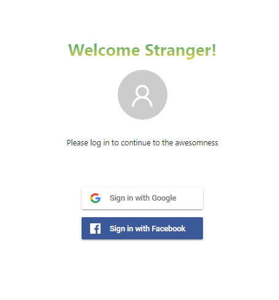
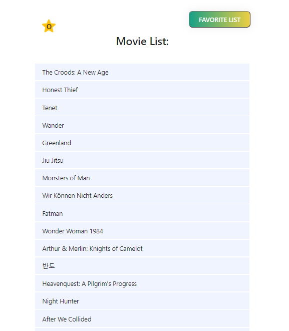
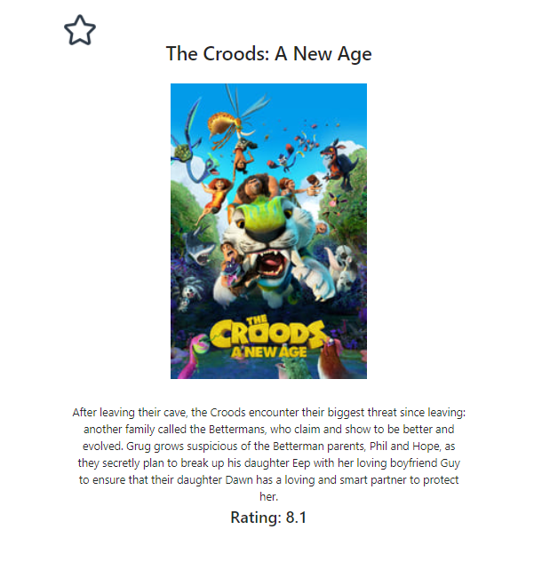

# my-movie-list# my-movie-list-app
Application of movie popular list from api:  https://www.themoviedb.org/documentation/api.  
Includes a list of favorite movies that can be added/deleted a favorite movie.  
The app requires sign in via gmail or facebook.    

<kbd></kbd>
<kbd></kbd>  
<kbd></kbd> 

### `npm start`
Runs the app in the development mode, in folder src  
Open [http://localhost:3000](http://localhost:3000) to view it in the browser.

